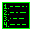

# Hi! What's up? 

-   I'm a computer lover
- 📚 I'm learning web technologies
- I speak 🇧🇷 Portuguese and 🇬🇧 English
- 💬 how to contact me: 
	-  Matrix: @xtvlw:matrix.org
	-  Telegram: @xtvlw
	-  Discord: Kim_Frost#4955

-  Git
	-  <a href="#">GitHub</a>
	-  [GitLab](https://gitlab.com/NightShine)
	
 

👤 About me

	

		
 
			👤 I'm someone who always like to learn and keep improving my knowledge about technologies.
		

		
 
			🎨 I'm also learning design, mostly using Inkscape and Gimp but sometimes using blender to make some 3D models.
		

		
 
			 I love open source projects, and one day i'll be part of one! 
		

	

 

## technologies that I use

<table align="center">
	<tr>
		<td align="center">
			<!--CSS3-->
			
			  CSS3
		</td>
		<td align="center">
			<!--HTML5-->
			
			  HTML5
		</td>
		<td align="center">
			<!--JavaScript-->
			
			  JavaScript
		</td>
		<td align="center">
			<!--React.JS-->
			
			  React.JS
		</td align="center">
		<td align="center">
			<!--TypeScript-->
			
			  TypeScript
		</td>
		<td align="center">
			<!--Node.JS-->
			
			  Node.JS
		</td>
		<td align="center">
			<!--python-->
			
			  Python
		</td>
	</tr>
	<tr>
		<td align="center">
			<!--Git-->
			
			  Git
		</td>
		<td align="center">
			<!--Docker-->
			
			  Docker
		</td>
		<td align="center">
			<!--jQuery-->
			
			  jQuery
		</td>
			<td align="center">
			<!--PostgreSQL-->
			
			  PostgreSQL
		</td>
		<td align="center">
			<!--Linux-->
			
			  Linux
		</td>
		</td>
			<td align="center">
			<!--KDE-->
			
			  KDE
		</td>
		<td align="center">
			<!--Inkscape-->
			
			  Inkscape
		</td>
	<tr>
</table>

## technologies that I'm learning

<table align="center">
	<tr>
		<td align="center">
			<!--C-->
			
			  C
		</td>
		<td align="center">
			<!--C++-->
			
			  C++
		</td>
			<td align="center">
			<!--Bash-->
			
			  Bash
		</td>
		<td align="center">
			<!--Electron-->
			
			  Electron
		</td>
		<td align="center">
			<!--Bootstrap-->
			
			  Bootstrap
		</td>
		<td align="center">
			<!--Blender-->
			
			  Blender
		</td>
			<td align="center">
			<!--Gimp-->
			
			  Gimp
		</td>
	<tr>
</table>
